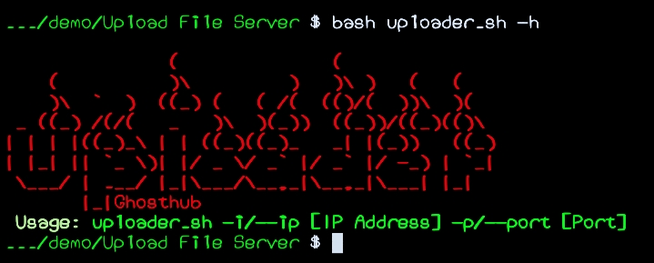

[![Forks][forks-shield]][forks-url]
[![Stargazers][stars-shield]][stars-url]
[![Issues][issues-shield]][issues-url]
[![MIT License][license-shield]][license-url]

<!-- PROJECT LOGO -->
<br />
<p align="center">
  <a href="https://github.com/Ba-hub/uploader.git">
    
  </a>

  <h3 align="center">uploader</h3>

  <p align="center">
    Cli & Web Based framework which help to share any file Client Side to Server Side, Whole Operation will be held on as first as quickly.
    <br />
</p>

### Prerequisites

Need php to run the Programs here process to Install php
* php
  ```sh
  apt-get install php
  ```

### Installation

1. Clone the repo
   ```sh
   git clone https://github.com/Ba-hub/uploader.git
   cd uploader
   chmod +x uploader.sh
   ./uploader.sh
   ```


<!-- LICENSE -->
## License

Distributed under the GNU License. See `LICENSE` for more information.


## Developer
```
Made By ~ Ghosthub 

```

